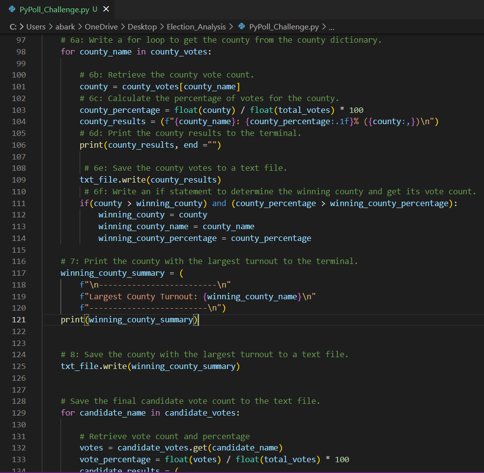
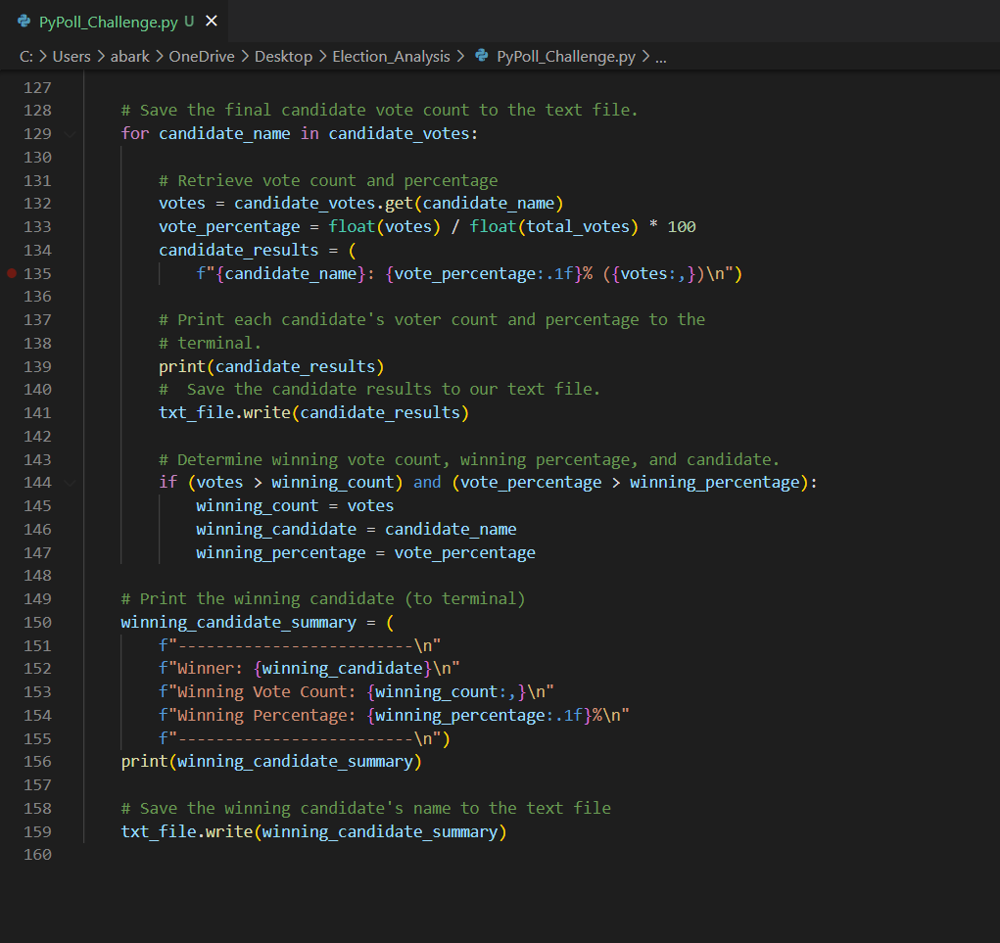
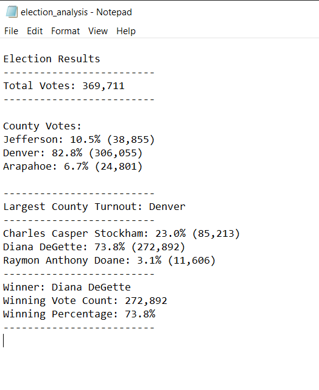
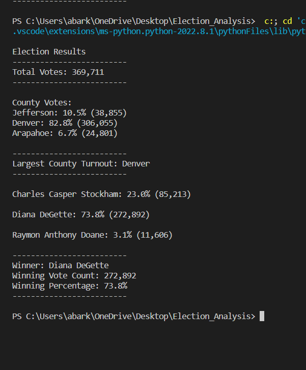

# Election Analysis

## Project Overview:

### In this Module, we were asked to assist Tom, a Colorado Board of Elections employee with an election audit of the results for a U.S Congressional Election in Colorado. 

### Our task was to collect and report the total number of votes cast, the total number of votes per candidate, the percentage of votes per each candidate, as well as the winner of the election. Later in the Challenge portion of this Module, we were tasked to collect the same information previously collected for "candidates", but this time for "counties".

## Election-Audit Results:

### Upon completing our analysis, we were able to gather the following results:

* Total Votes Cast in the election were: 

	* 369,711 Votes.

* Number of Votes and Percentage of votes per County:

	* Denver: 306,055 votes, 82.8% of total votes.
	* Jefferson: 38,855 votes, 10.5% of total votes.
	* Arapahoe: 24,801 votes, 6.7% of total votes.

* Denver County had the highest number of votes, with 306,055 votes.

* Candidates' names:

	* Charles Casper Stockham
	* Diana DeGette
	* Raymon Anthony Doane

* Candidates' results:

	* Charles Casper Stockham: 85,213 votes, 23.0%
	* Diana DeGette: 272,892 votes, 73.8%
	* Raymon Anthony Doane: 11,606 votes, 3.1%

* The final winner of the election was:

	* Diana DeGette, with a total of 272,892 votes or 73.8% of the total votes collected.

## Election-Audit Summary:

### This analysis allowed us to provide plenty of input utilizing three critical variables, candidates, counties and ballot ID's. Using the same information, we could be able to add another results showing how many votes each candidate received in each county, as well as the percentage per candidate per county.
### We could use a similar script for other counties and candidates by just adding or modifying the Data Sources initially provided, we can even add more counties to the list if/when appropriate.
### With that said, provided the right data, we can utilize a similar script to collect information maybe on any type of elections within a specific state or country, as long as the data source provides a list of candidates, counties or cities involved, and ballot numbers, as we noticed when we added the results per county section to the script, the format of the code remained mainly the same, we only had to provide and add commands to search and gather information for counties instead of candidates.
